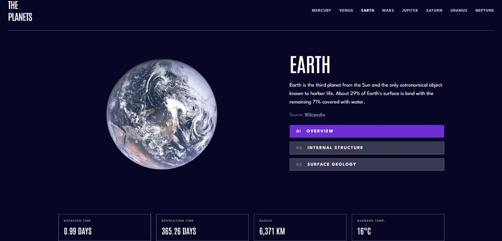

# 🪐 Planets Fact Site

A responsive 8-page fact site built using **HTML**, **CSS**, and **Vanilla JavaScript**, where users can explore detailed information about all the planets in our solar system.

Inspired by the challenge from Frontend Mentor and designed to resemble a futuristic and clean UI just like NASA’s information pages. This project is perfect for your portfolio if you're learning frontend development!

---

## 🌟 Features

- 🪐 Explore all 8 planets: Mercury to Neptune
- 🧠 3 tabs per planet: **Overview**, **Internal Structure**, **Surface Geology**
- 🎨 Dynamic color theming per planet
- 🌐 Responsive design (Mobile, Tablet, Desktop)
- 🎥 Rotating planet images using animation
- 📱 Mobile-friendly hamburger menu
- ⚙️ Clean modular JavaScript code

---

## 📁 Folder Structure

planets-fact-site/
├── index.html
├── styles.css
├── script.js
└── assets/
├── mercury.png
├── venus.png
├── earth.png
├── mars.png
├── jupiter.png
├── saturn.png
├── uranus.png
├── neptune.png

---

## 🖼️ Preview

| Desktop View | Mobile View |
|--------------|-------------|
|  | 
 |

---

## 🛠️ Technologies Used

- HTML5
- CSS3 (Flexbox, Grid, Media Queries)
- JavaScript (DOM Manipulation)
- Google Fonts (Antonio, League Spartan)
- CSS Variables & Animations

---

## 📲 Responsive Design

The layout adapts for:
- 💻 Large Screens
- 📱 Mobile Devices
- 🧾 Tablet Devices

